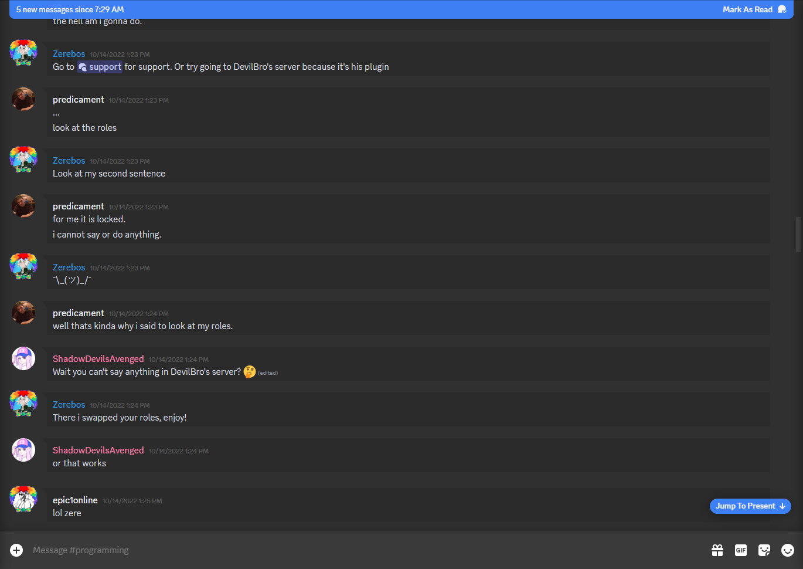
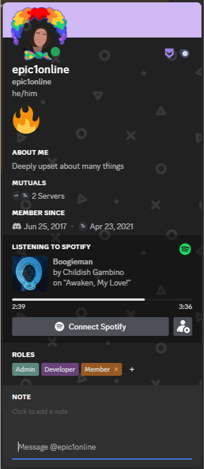
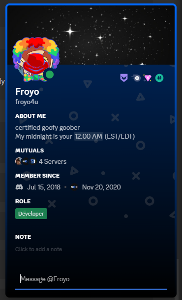
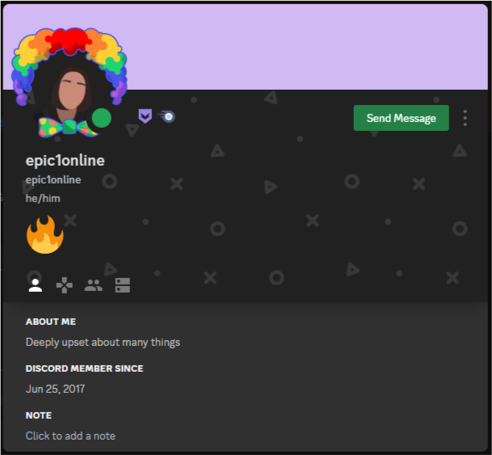
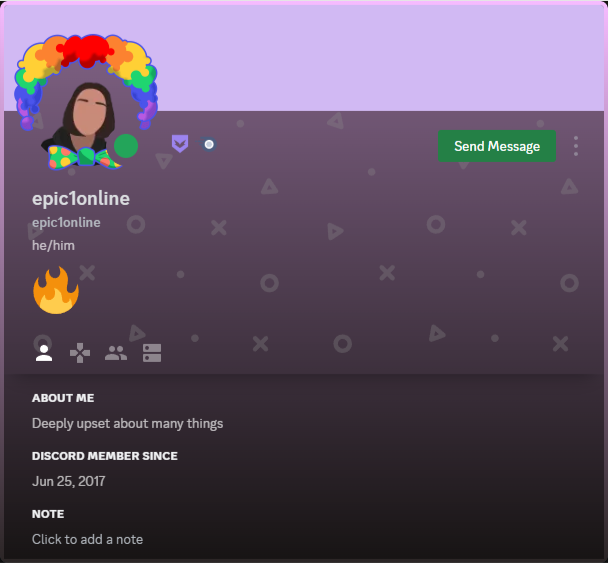
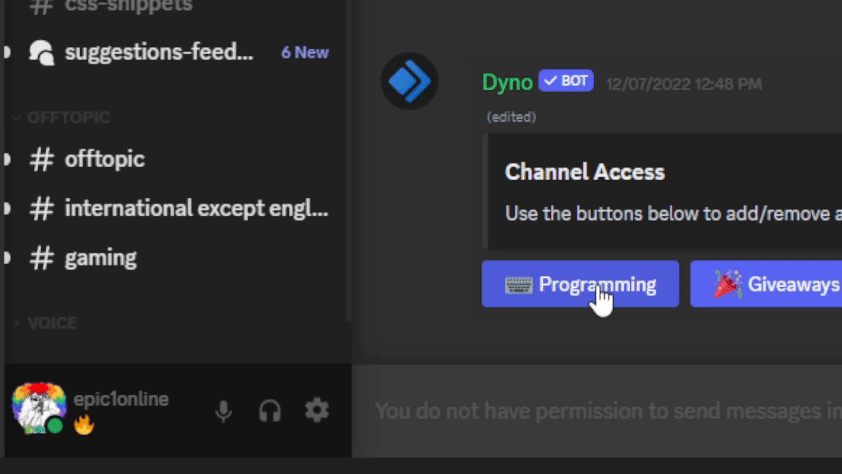

# Nox - [Download](https://betterdiscord.app/Download?id=3)

A beautiful dark material theme for Discord. This is the rebrand and continuation of Beard's Material Design Theme which has been discontinued.

For support and to report bugs, please visit the [support server](https://bit.ly/NoxServer).

# Variables

These variables allow you to customize the theme to your preferences.

 - `--nox-accent` - The accent color you want for the theme. Default: `#3F85FF`
 - `--nox-notification-color` - Color for the unread indicator in guilds list. Default: `#FFFFFF`
 - `--nox-notification-width` - Width of the circle around guilds. Default: `3px`
 - `--nox-important-notification` - Background color for mention/ping badges. Default: `#F04747`
 - ~~`--nox-channels-scrollbar` - Set this to `none` to remove the scrollbar in the channel list.~~
 - ~~`--nox-settings-scrollbar` - Set this to `none` to remove the scrollbar in settings.~~
 - ~~`--nox-settings-time` - Length of the animation to open settings. Default: `500ms`~~
 - `--nox-level1` - One of the main grays used throughout the theme. Default: `#303030`
 - `--nox-level2` - One of the main grays used throughout the theme. Default: `#212121`
 - `--nox-level3` - One of the main grays used throughout the theme. Default: `#141414`

 # Addons

Addons are currently non-working but may be added back eventually.
~~There are a number of addons and customizations available for the theme that can be found on the [support server](http://bit.ly/BMTserver).~~

# Previews

## Main Chat

## User Popout
 

## User Profile
 

## Status Picker

